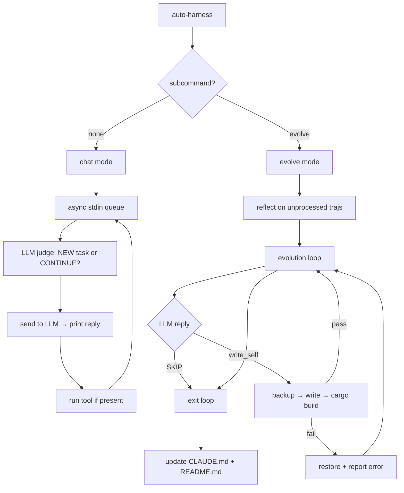

# AutoHarness

A self-evolving coding agent in Rust — the smallest possible implementation that actually works.


The agent has two modes: an interactive CLI where you give it tasks, and a self-evolution loop where it reads its own source, proposes improvements, verifies them, and repeats. The LLM is the judge — no numeric scoring.

## How it works



### Chat mode

Interactive REPL. Stdin is read in a background thread and pushed to a queue so you can keep typing while the LLM is processing. Each reply is printed; everything else is logged to `.evo/sessions/<ts>/traj.jsonl`.

The LLM automatically groups your messages into tasks — if a new message starts a different topic, artifacts go into a new `outputs/<ts>/task_N` directory.

### Evolve mode

1. **Reflect** — reads chat session trajs newer than the last watermark, asks the LLM for one concrete improvement suggestion, logs it.
2. **Evolve** — up to `MAX_ITERS` iterations. Each iteration: show LLM current `src/main.rs` → propose one change → verify with `cargo build`. The LLM can reply `SKIP` to exit immediately if nothing is worth changing.
3. **Doc update** — after the loop, the LLM rewrites `CLAUDE.md` and `README.md` to match the current implementation.

### Tool dispatch

The LLM emits plain-text XML-like tags — no framework, no function-calling schema:

```
<tool name="shell">cargo test 2>&1</tool>
<tool name="write_self">...full new src/main.rs...</tool>
<tool name="write_file">path/to/file
...full content...</tool>
```

`write_self` is atomic: backup → write → `cargo build --release` → restore on failure, reporting the compiler error back to the LLM so it can self-correct.

## Installation

```bash
# Install Rust (if not already installed)
curl --proto '=https' --tlsv1.2 -sSf https://sh.rustup.rs | sh
source $HOME/.cargo/env

# Clone the repository
git clone https://github.com/Engineering4AI/AutoHarness
cd AutoHarness

# Set API key
echo "OPENROUTER_API_KEY=sk-or-..." > .env

# Build and run
cargo build --release
./target/release/auto-harness          # interactive chat
./target/release/auto-harness evolve   # self-evolution loop
```

Any OpenAI-compatible endpoint works (Ollama, vLLM, Together, etc.):

```bash
export OPENROUTER_API_KEY=anything
export INFERENCE_BASE_URL=http://localhost:11434/v1
export MODEL_NAME=llama3
```

## File layout

```
.
├── Cargo.toml
├── src/
│   └── main.rs             # the entire agent (~450 lines)
├── .env                    # API keys (not committed)
├── .evo/
│   ├── sessions/<ts>/      # one dir per run, contains traj.jsonl
│   └── learned_until.txt   # reflection watermark
└── outputs/<ts>/
    ├── task_1/             # artifacts for task 1
    └── task_2/             # artifacts for task 2 (if new task detected)
```

## Configuration

| Variable | Default | Description |
|---|---|---|
| `OPENROUTER_API_KEY` | — | OpenRouter key (required) |
| `INFERENCE_BASE_URL` | `https://openrouter.ai/api/v1` | Any OpenAI-compat base URL |
| `MODEL_NAME` | `anthropic/claude-opus-4` | Model identifier |

`MAX_ITERS` (default `10`) and `PATIENCE` (default `3`) are compile-time constants in `src/main.rs`.

## Citation

If you use AutoHarness in your research, please cite:

```bibtex
@software{autoharness2026,
  title  = {AutoHarness: A Self-Evolving Coding Agent in Rust},
  author = {Zhao, Zhimin},
  year   = {2026},
  url    = {https://github.com/Engineering4AI/AutoHarness}
}
```
