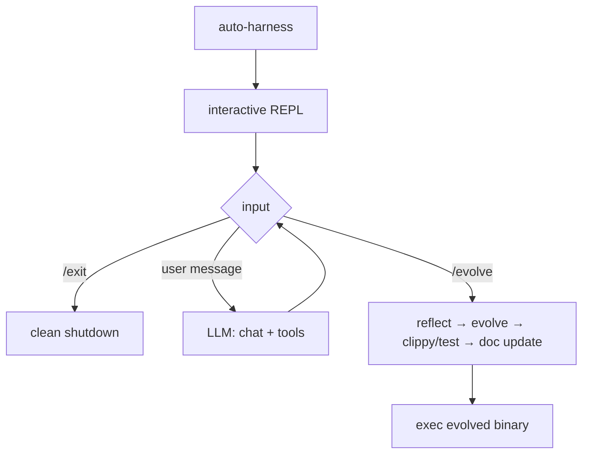

# AutoHarness

<p align="center">
  <strong>A self-evolving coding agent in Rust.</strong><br/>
  Chat with it, let it reflect, and let it improve itself.
</p>

<p align="center">
  
  
  
</p>

<p align="center">
  
</p>

---

## ✨ What is AutoHarness?

AutoHarness is a compact Rust agent that runs as an interactive REPL. It logs everything to `.evo/`, verifies self-edits with `cargo build --release`, and uses the LLM as the judge — no numeric reward model.

Type `/evolve` inside the running agent to trigger a reflection + self-improvement loop. When evolution finishes, the process re-execs itself with the updated binary automatically.

---

## 🚀 Quick Start

```bash
# Build
cargo build --release

# Run
./target/release/auto-harness
# Inside the REPL:
#   /evolve   — reflect on past sessions and rewrite the agent, then relaunch
#   /exit     — clean shutdown
```

Use any OpenAI-compatible backend:

```bash
# Local model (Ollama)
export OPENROUTER_API_KEY=unused
export INFERENCE_BASE_URL=http://localhost:11434/v1
export MODEL_NAME=llama3

# OpenRouter
export OPENROUTER_API_KEY=<your-key>
```

---

## 🧠 How It Works


```mermaid
flowchart TD
    A[auto-harness] --> B[interactive REPL]
    B --> C{input}
    C -->|/exit| Z[clean shutdown]
    C -->|user message| E[LLM: chat + tools]
    E --> C
    C -->|/evolve| D[reflect → evolve → clippy/test → doc update]
    D --> R[exec evolved binary]
```

---

## 🔧 Operation

### Interactive REPL
- Async stdin queue (`VecDeque` fed by a background thread)
- LLM decides if each message starts a **new task** or **continues** the current one
- Task artifacts go to `outputs/<ts>/task_N/`
- All events logged to `.evo/sessions/<ts>/traj.jsonl`
- Slash commands: `/exit` (quit), `/evolve` (evolve + relaunch)

### `/evolve`
1. **Reflect:** analyze unprocessed trajectories → one concrete improvement suggestion
2. **Evolve:** up to `MAX_ITERS` iterations; LLM sees full prompt files, `AGENTS.md`, `memory/*.md`, and `main.rs`; proposes one change per iter
3. **Validate:** `cargo clippy --no-deps -- -D warnings` + `cargo test --release`
4. **Doc update:** rewrite `CLAUDE.md` and `README.md` (reflects the tested, working state)
5. **Relaunch:** `exec()` replaces the process with the freshly-built binary

---

## 🧩 Evolvable Artifacts

| Artifact | Tool | Notes |
|---|---|---|
| `src/main.rs` | `write_self` | Atomic: backup → write → build-verify → restore on fail |
| `src/AGENTS.md` | `write_file` | Backed up before overwrite |
| `src/prompts/*.txt` | `write_file` | Backed up before overwrite |
| `src/memory/*.md` | `write_file` | Reference notes; new files created freely |
| `CLAUDE.md` / `README.md` | `write_file` | Doc update step |

Evolution file rules (enforced at runtime):
- `write_file` restricted to `src/memory/`, `src/prompts/`, `src/AGENTS.md`, `CLAUDE.md`, `README.md`
- `delete_file` restricted to `src/`; `src/main.rs` and `src/AGENTS.md` are protected
- All modified `src/` files are auto-backed-up as `<stem>.<ts>.<ext>.bak`

---

## 🗂️ Project Layout

```text
.
├── Cargo.toml
├── README.md
├── CLAUDE.md
├── src/
│   ├── main.rs
│   ├── AGENTS.md
│   ├── memory/          ← reference notes, evolved freely
│   └── prompts/
│       ├── chat_system.txt
│       ├── reflect_system.txt
│       ├── evolve_system.txt
│       └── doc_system.txt
├── .evo/
│   ├── sessions/<ts>/traj.jsonl
│   └── learned_until.txt
└── outputs/<ts>/task_N
```

---

## ⚙️ Configuration

| Variable | Default | Description |
|---|---|---|
| `OPENROUTER_API_KEY` | required | API key |
| `INFERENCE_BASE_URL` | `https://openrouter.ai/api/v1` | OpenAI-compatible API endpoint |
| `MODEL_NAME` | `anthropic/claude-opus-4` | Model identifier |

Core constants in `src/main.rs`:
- `MAX_ITERS = 10`
- `PATIENCE = 3`

---

## 📚 Citation

```bibtex
@software{autoharness2026,
  title  = {AutoHarness: A Self-Evolving Coding Agent in Rust},
  author = {Zhao, Zhimin},
  year   = {2026},
  url    = {https://github.com/Engineering4AI/AutoHarness}
}
```
