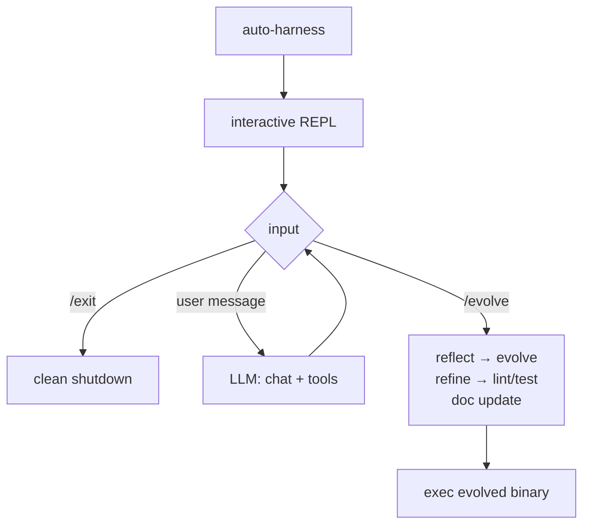

# AutoHarness

<p align="center">
  <strong>A self-evolving coding agent in Rust.</strong><br/>
  Chat with it, let it reflect, and let it improve itself.
</p>

<p align="center">
  
  
  
</p>

<p align="center">
  
</p>

---

## ✨ What is AutoHarness?

AutoHarness is a compact Rust agent that runs as an interactive REPL. It logs everything to `.evo/`, verifies self-edits with `cargo build --release`, and uses the LLM as the judge — no numeric reward model.

Type `/evolve` inside the running agent to trigger a reflection + self-improvement loop. When evolution finishes, the process re-execs itself with the updated binary automatically.

---

## 🚀 Quick Start

```bash
# Build
cargo build --release

# Run
./target/release/auto-harness
# Inside the REPL:
#   /evolve   — reflect on past sessions and rewrite the agent, then relaunch
#   /exit     — clean shutdown
```

Use any OpenAI-compatible backend:

```bash
# Local model (Ollama)
export OPENROUTER_API_KEY=unused
export INFERENCE_BASE_URL=http://localhost:11434/v1
export MODEL_NAME=llama3

# OpenRouter
export OPENROUTER_API_KEY=<your-key>
```

---

## 🧠 How It Works


```mermaid
flowchart TD
    A[auto-harness] --> B[interactive REPL]
    B --> C{input}
    C -->|/exit| Z[clean shutdown]
    C -->|user message| E[LLM: chat + tools]
    E --> C
    C -->|/evolve| D[reflect → evolve<br/>refine → lint/test<br/>doc update]
    D --> R[exec evolved binary]
```

---

## 🔧 Operation

### Interactive REPL
- Async stdin queue (`VecDeque` fed by a background thread)
- LLM decides if each message starts a **new task** or **continues** the current one
- After the assistant stops using tools, a completion check can continue the same task instead of immediately returning to the prompt
- Task artifacts go to `outputs/<ts>/task_N/`
- All events logged to `.evo/sessions/<ts>/traj.jsonl`
- Slash commands: `/exit` (quit), `/evolve` (evolve + relaunch)

### `/evolve`
1. **Reflect:** analyze unprocessed trajectories (progressive disclosure — stripped summary first; LLM reads more via `read_file path start..end`) → one concrete improvement suggestion
2. **Evolve:** unbounded iterations; LLM sees full prompt files, `AGENTS.md`, `memory/` index (filepath + description), and `main.rs`; proposes one change per iter; stops on `SKIP`
3. **Refine:** clippy + test output fed to LLM for `write_file` fixes
4. **Final lint/test:** `cargo clippy --no-deps -- -D warnings` + `cargo test --release` — authoritative gate
5. **Doc update:** rewrite `CLAUDE.md` and `README.md` (reflects the verified, working state)
6. **Relaunch:** `exec()` replaces the process with the freshly-built binary

---

## 🧩 Evolvable Artifacts

| Artifact | Tool | Notes |
|---|---|---|
| `src/main.rs` | `write_file` | Atomic: backup → write → build-verify → restore on fail |
| Any `src/**` non-`.bak` | `write_file` | All `.rs`, `.md`, `.txt` under `src/` |
| `CLAUDE.md` / `README.md` | `write_file` | Doc update step |

Both `read_file` and `write_file` accept an optional `start..end` char-offset range for partial reads/patches.

Evolution file rules (enforced at runtime):
- `write_file` allowed for any `src/**` path (non-`.bak`), `CLAUDE.md`, `README.md`
- `src/main.rs` writes trigger `cargo build --release`; failure auto-reverts
- `delete_file` restricted to `src/`; `src/main.rs` and `src/AGENTS.md` are protected
- All modified files auto-backed-up as `<stem>.<ts>.<ext>.bak`

---

## 📉 Progressive Disclosure

| Call site | Limit | Mechanism |
|---|---|---|
| Reflection traj | 8 000 chars | Strip `content`/`preview` fields; cap strings at 120 chars; LLM may `read_file path start..end` for more |
| Task-grouping judge | 6 messages | Sliding window |
| Completion judge | 12 messages | Sliding window plus original user prompt |
| Chat history | 20 messages | `drain(..len-20)` after each push |
| bash output | 2 000 chars | `.chars().take(2000)` |
| Build error | 400 chars | Substring on compiler stderr |
| `read_file` default window | 16 000 chars | LLM sees hint to continue reading with next range |
| Evolve iter | full `src/main.rs` + prompts + `src/AGENTS.md` + `src/memory/` index (filepath + desc) | LLM must see whole files to propose a change |
| Doc update | full `src/main.rs` + `CLAUDE.md` + `README.md` | One-shot, acceptable |

---

## 🧾 Trajectory Logging

Every run creates `.evo/sessions/<unix_timestamp>/traj.jsonl`:

```json
{"ts": 1713300000, "kind": "session_start",  "data": {}}
{"ts": 1713300001, "kind": "user_input",      "data": "fix the bug"}
{"ts": 1713300005, "kind": "llm_response",    "data": {"task": 1, "turn": 1, "preview": "..."}}
{"ts": 1713300008, "kind": "task_boundary",   "data": {"task": 2}}
{"ts": 1713300010, "kind": "tool_result",     "data": {"tool": "write_self", "result": "written and verified OK"}}
{"ts": 1713300011, "kind": "session_end",     "data": {"turns": 4}}
{"ts": 1713300020, "kind": "iter_start",      "data": {"iter": 1}}
{"ts": 1713300025, "kind": "iter_end",        "data": {"iter": 1, "improved": true}}
{"ts": 1713300026, "kind": "iter_skip",       "data": {"iter": 2, "reason": "LLM chose not to evolve"}}
{"ts": 1713300027, "kind": "evolve_end",      "data": {}}
```

---

## 🗂️ Project Layout

```text
.
├── Cargo.toml
├── README.md
├── CLAUDE.md
├── src/
│   ├── main.rs
│   ├── AGENTS.md
│   ├── memory/          ← reference notes, evolved freely
│   └── prompts/
│       ├── chat_system.txt
│       ├── reflect_system.txt
│       ├── evolve_system.txt
│       └── doc_system.txt
├── .evo/
│   ├── sessions/<ts>/traj.jsonl
│   └── learned_until.txt
└── outputs/<ts>/task_N
```

---

## ⚙️ Configuration

| Variable | Default | Description |
|---|---|---|
| `OPENROUTER_API_KEY` | required | API key |
| `INFERENCE_BASE_URL` | `https://openrouter.ai/api/v1` | OpenAI-compatible API endpoint |
| `MODEL_NAME` | `anthropic/claude-opus-4` | Model identifier |

Core constants in `src/main.rs`:
- `SELF_PATH = "src/main.rs"` — file the agent reads and rewrites
- `WATERMARK_PATH = ".evo/learned_until.txt"` — tracks last reflected session

The evolution loop is unbounded — it runs until the LLM replies `SKIP`.

---

## 📚 Citation

```bibtex
@software{autoharness2026,
  title  = {AutoHarness: A Self-Evolving Coding Agent in Rust},
  author = {Zhao, Zhimin},
  year   = {2026},
  url    = {https://github.com/Engineering4AI/AutoHarness}
}
```
